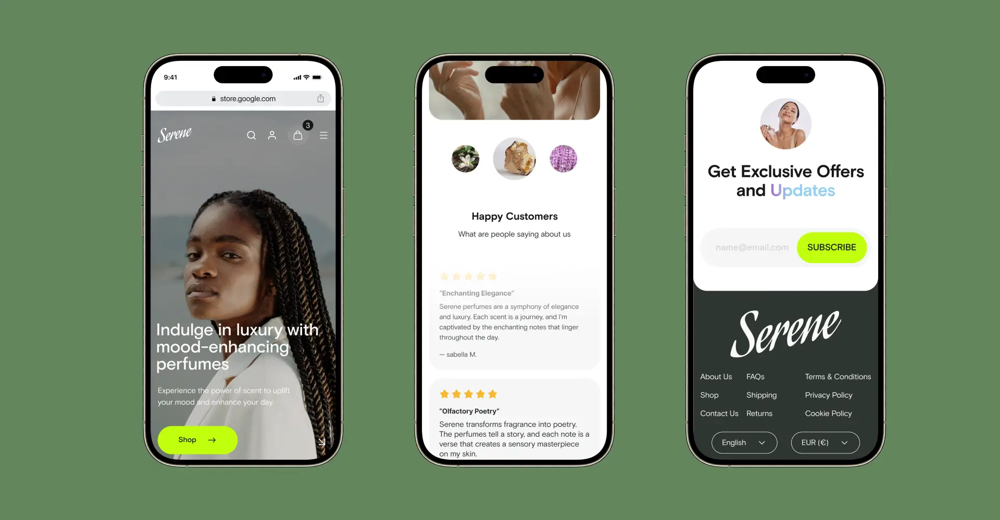

<div align="center">
  <a href="https://serene-theta.vercel.app">
    
  </a>

  <br/>

</div>

<p>⚠️ This website is in construction ⚠️ </p>

<br/>

<h1>Serene - Luxury Perfume Shopify & Next.js Website</h1>

<br/>

## Overview

Welcome to the Serene repository! This project represents the codebase for a luxury perfume brand's Shopify-backed Next.js website. I aim to create an immersive online experience for users, combining the elegance of luxury perfumes with cutting-edge web technologies.

## Features

#### Next.js for React Framework

> Leverage the power of Next.js for server-side rendering, efficient client-side navigation, and seamless integration with our Shopify Headless CMS.

#### Shopify Headless CMS Integration

> Utilize the Shopify API to dynamically fetch product information, collections, and other content, ensuring a real-time, data-driven experience for users.

#### Responsive Design

> Crafted with a mobile-first approach, ensuring an optimal user experience across various devices and screen sizes.

#### Immersive UI/UX

> Incorporate visually stunning design elements to reflect the luxury and sophistication of our brand.

#### Sustainability

> Integrate a dedicated section showcasing our commitment to sustainability, highlighting responsibly sourced ingredients and ethical practices.



## Tech Stack

⚛️ **Next.js:** React framework for efficient server-side rendering and client-side navigation.

🛍️ **Shopify API:** Headless CMS integration for dynamic product information and content.

🔎 **OramaSearch:** Full-text and vector search engine with typo tolerance that enhances the search functionality on our website, providing users with a seamless and intuitive search experience.

🧦 **Framer Motion:** A declarative React animation library.

## Quick Start

#### 1. Clone the Repository:

```bash
git clone git@github.com:derciojds/serene.git
```

<!-- # cd serene -->

#### 2. Install Dependencies:

```bash
cd serene
bun install
```

#### 3. Configure Shopify API:

Obtain your Shopify Store API credentials.
Create the `.env` file with your Shopify Store credentials and make sure that you're following the environment variables as in the [`.env.example`](./.env.example) file.

#### 4. Run the Development Server:

```bash
bun run dev
```

The development server will be running at `http://localhost:3000.`

## License

This project is licensed under the **Creative Commons Attribution-NonCommercial (CC BY-NC) license** - see the [LICENSE](./LICENSE.md) file for details.

## Acknowledgments

Inspired by other successful e-commerce projects on GitHub.
Contact
For any inquiries or feedback, please contact derciojdsd@gmail.com.

💫 Happy coding!
